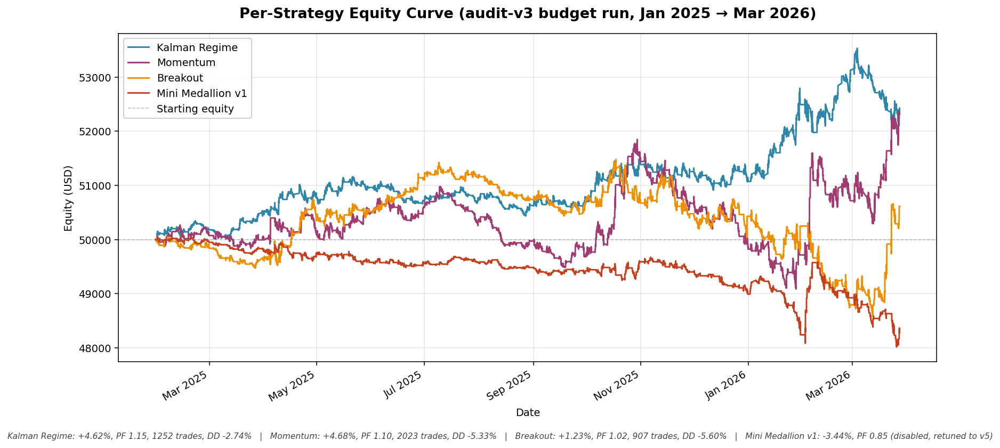
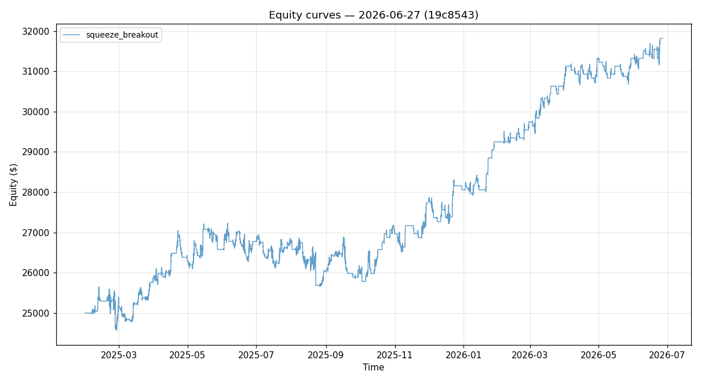
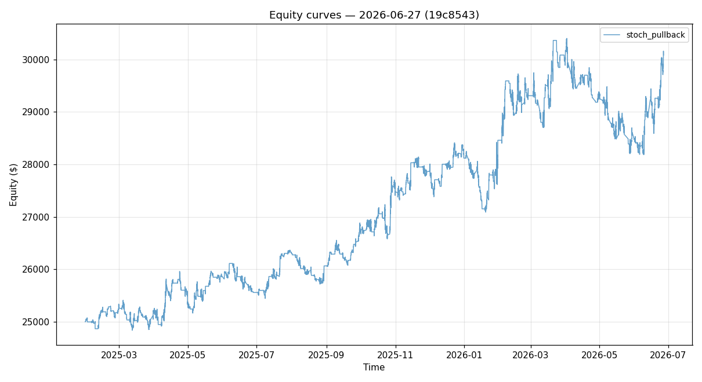
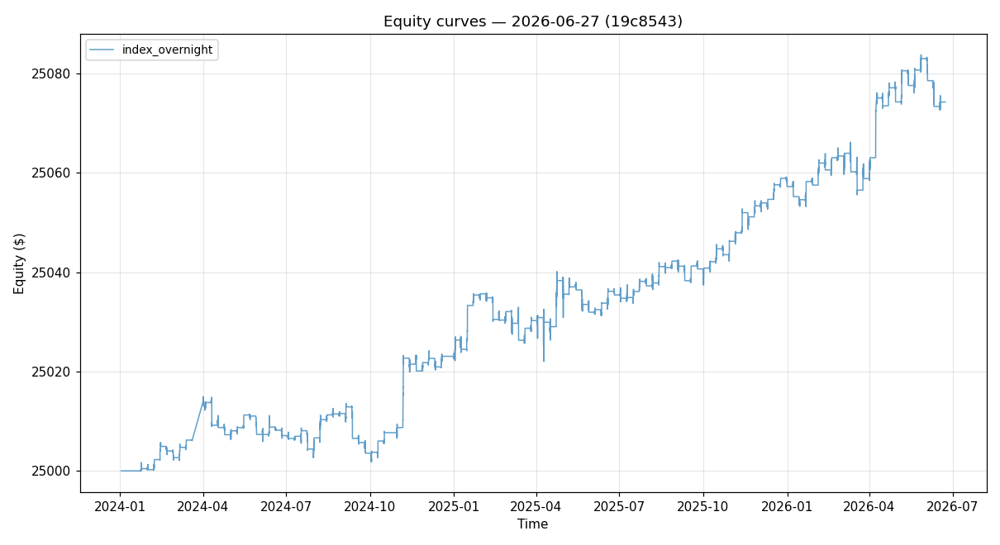
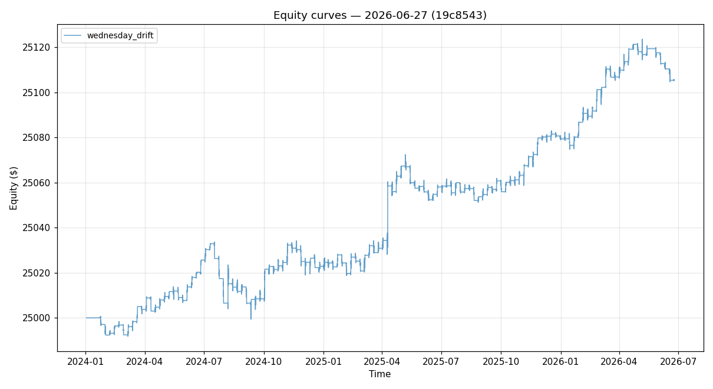

# Quant Trading System

[](LICENSE)
[](https://www.python.org/downloads/)
[](https://www.metatrader5.com/)
[](https://github.com/vrd07/Quant_Trading/stargazers)
[](https://github.com/vrd07/Quant_Trading/commits/main)

> A production-grade multi-strategy algorithmic trading system for **XAUUSD** (spot gold), BTC, ETH, and EUR/USD on **MetaTrader 5**. Built to survive prop-firm risk rules — daily-loss caps, trailing drawdowns, and one-strike-you're-out evaluations.

📄 **[Read the full research paper →](RESEARCH_PAPER.md)** *(15,500 words covering every subsystem)*

---

## ✨ What makes it different

- **13 independent strategies** — Kalman regime, momentum, VWAP reversion, structure-break retest, SMC order blocks with FVG confluence, Fibonacci golden zone, Asia range fade, a USDJPY London breakout, Monday / Wednesday calendar drifts, a volatility-squeeze breakout, a stochastic trend-pullback, and a "Turnaround-Tuesday" index-overnight edge — each independently configurable, regime-gated, symbol-gated, and session-whitelisted.
- **A 16-step risk engine** that has absolute veto power over every order. No order reaches MT5 without passing kill-switch, circuit-breaker, hour-blackout, daily-loss budget, drawdown, exposure, and per-trade-risk checks. Any breach trips a one-way kill switch that requires manual reset.
- **A nightly ML regime classifier** (RandomForest + Markov chain smoother + RL-lite performance feedback) that rewrites strategy weights once per UTC day so the system adapts to TREND / RANGE / VOLATILE regimes without code changes.
- **Crash-safe state management** — every state mutation is serialised to disk every 10 seconds; a power outage at 03:00 UTC produces a recoverable system at 03:01 UTC.
- **Cross-platform** — first-class on Windows 11 **and** macOS (official MetaTrader 5 desktop app, one double-clickable launcher with native dialogs); Linux via Wine-hosted MT5. The file-based bridge speaks the same protocol on every OS.
- **Audit-driven, not vibes-driven** — every parameter in the live config is annotated with the backtest or production-audit decision that produced it.

## 📊 The strategy stack

| # | Strategy | TF | Symbol | Style | Live |
|---|---|---|---|---|---|
| 1 | Kalman Regime | 15m | XAUUSD | Trend / OU mean-rev hybrid | ✅ |
| 2 | Momentum | 5m | XAUUSD | ROC + ADX confirmation | ✅ |
| 3 | VWAP | 15m | XAUUSD | Institutional reversion | ✅ |
| 4 | Structure-Break Retest | 15m | XAUUSD | Donchian break + retest rejection | ✅ |
| 5 | Fibonacci Retracement | 5m | XAUUSD | Golden-zone pullback (50–61.8 %) | ✅ |
| 6 | SMC Order Block | 5m | XAUUSD | 5-phase ICT state machine + FVG | ✅ |
| 7 | Asia Range Fade | 15m | XAUUSD | UTC 09–14 low-vol fade | ✅ |
| 8 | London Breakout | 5m | USDJPY | Asia-range first-break | ✅ |
| 9 | Monday Drift | 15m | GBPUSD / AUDUSD | Anti-USD Monday hold (SMA-gated) | ✅ |
| 10 | Squeeze Breakout | 15m | XAUUSD | Volatility coil → expansion, HTF-trend gated | ✅ |
| 11 | Stoch Pullback | 15m | XAUUSD | EMA-trend + Stochastic pullback | ✅ |
| 12 | Index Overnight | 15m | US30 | "Turnaround-Tuesday" overnight drift | ✅ |
| 13 | Wednesday Drift | 15m | AUDJPY | Mid-week JPY-weakness carry drift | ✅ |

> Raw signals from #2–#7 are post-filtered by a **ConfluenceGate** (only Kalman, London Breakout, and the calendar/standalone edges fire solo). Strategies #8–#13 carry hard in-code symbol gates, so they only ever trade their listed instrument. The six legacy strategies (Breakout, Mini Medallion, Supply/Demand, Descending Channel, Continuation Breakout, Mean Reversion) were retired in June 2026 after failing the walk-forward deploy gate.

## 📈 Backtest results (audit-v3 budget run)



All four strategies were run on the same period (Jan 2025 → Mar 2026, XAUUSD 5-minute / 15-minute bars) under an identical per-trade USD risk budget so the comparison isolates the strategy from the position-sizer's choices.

| Strategy | Return | PF | Trades | Max DD |
|---|---:|---:|---:|---:|
| **Kalman Regime** | **+4.62%** | 1.15 | 1,252 | −2.74% |
| **Momentum** | **+4.68%** | 1.10 | 2,023 | −5.33% |
| **Breakout** | +1.23% | 1.02 | 907 | −5.60% |
| Mini Medallion v1 | −3.44% | 0.85 | 668 | −4.07% |

Mini Medallion v1 lost money and was disabled, then re-enabled as v5 with retuned parameters (51 % WR, PF 1.31, 6.9 % annualised on a fresh 12-month sample). The audit-driven discipline is documented in [Section 18 of the paper](RESEARCH_PAPER.md#18-empirical-lessons).

### Latest strategy backtests — #10–13 (Jun 2026)

Production-engine runs (`run_backtest.py --timeframe 15m`, 2.5 y Dukascopy history) for the four newest strategies, each on its in-code-gated live symbol. Full reports with charts and gate breakdowns: **[reports/new_strategies_backtest_2026-06-27.md](reports/new_strategies_backtest_2026-06-27.md)**.

| # | Strategy | Symbol | Trades | Win % | PF | Return | Max DD |
|---|---|---|---:|---:|---:|---:|---:|
| 10 | Squeeze Breakout | XAUUSD | 283 | 36.7 % | **1.50** | +27.27 % | −5.76 % |
| 11 | Stoch Pullback | XAUUSD | 658 | 33.4 % | **1.22** | +20.34 % | −7.30 % |
| 12 | Index Overnight | US30 | 123 | 58.5 % | **1.78** | +0.30 % | −0.06 % |
| 13 | Wednesday Drift | AUDJPY | 126 | 60.3 % | **1.67** | +0.42 % | −0.14 % |

| | |
|---|---|
|  |  |
|  |  |

These are risk-bypassed (strategy-native SL/TP) and graded against the `backtest.md` §1 gates — they ship as low-correlation **diversifiers**, not stand-alone gate-passers. Index Overnight and Wednesday Drift are once-a-week calendar edges (small absolute $ at placeholder sizing; read them on PF and drawdown). The first two run on gold and partially correlate with the Kalman book.

## 🏗️ Architecture

```
  MT5 Terminal
       │
       ▼
  EA_FileBridge.mq5  ◄────►  shared JSON files  ◄────►  mt5_file_client.py
                                                            │
                                                            ▼
                                                     MT5Connector
                                                            │
                                                            ▼
                                                      DataEngine ── ticks → bars (5 TFs) → indicators
                                                            │
                                                            ▼
                                                  StrategyManager (13 strategies fire on bar close)
                                                            │
                                                            ▼
                                                ┌─── RiskEngine ──── 16 sequential checks ──── ✗ reject
                                                │     │ kill switch · circuit breaker · drawdown
                                                │     │ daily-loss budget · exposure · risk-per-trade
                                                │     ▼
                                                │  ExecutionEngine ──► MT5 ──► Market
                                                │     │
                                                │     ▼
                                                │  PortfolioEngine ──► TradeJournal · StateManager
                                                │
                                                └── nightly: regime_classifier.py rewrites weights
```

## ⚠️ Important Disclaimer

> This bot trades **real money** on a live account. You can lose your entire balance.
> Only run this if you fully understand the risks and have tested everything first.
> No part of this repository constitutes financial advice.

---

## 🗂️ What This Bot Does

This is an **automated gold (XAUUSD) trading bot** built for the **The5ers $5,000 prop firm challenge**. It:

- Connects to MetaTrader 5 (MT5) on your PC or Mac
- Automatically analyzes gold prices 24/7
- Places and manages trades using multiple strategies
- Enforces strict risk rules (daily loss limits, trailing stops, etc.)
- Targets a **$400 profit** while staying within a **5% daily loss** and **10% drawdown** limit

---

## 🚀 Quick Start — pick your OS

Both guides below are written for non-technical users. No coding knowledge needed — just follow each step in order.

- 🪟 **Windows 11** → continue reading below
- 🍎 **macOS** → jump to [Quick Start (macOS)](#-quick-start-macos-non-technical-users)

---

## 🪟 Quick Start (Windows 11, non-technical users)

---

## 🖥️ Step 1 — What You Need

Before you start, make sure you have:

| Requirement | Where to Get It |
|---|---|
| Windows 11 PC | Your current PC |
| Internet connection | Your router/WiFi |
| MetaTrader 5 | [Download here](https://www.metatrader5.com/en/download) |
| A The5ers MT5 account | [The5ers website](https://the5ers.com/) |
| Python 3.11 | [Download here](https://www.python.org/downloads/) |
| Git | [Download here](https://git-scm.com/download/win) |

---

## 🐍 Step 2 — Install Python

1. Go to [python.org/downloads](https://www.python.org/downloads/)
2. Click **"Download Python 3.11.x"**
3. Run the installer
4. ✅ **VERY IMPORTANT:** On the first screen, tick **"Add Python to PATH"** before clicking Install

   

5. Click **"Install Now"**
6. When done, click **"Close"**

**Verify it worked:** Press `Win + R`, type `cmd`, press Enter. Then type:
```
python --version
```
You should see something like `Python 3.11.9`. If you get an error, Python was not added to PATH — reinstall and tick the box.

---

## 📥 Step 3 — Download the Bot

1. Press `Win + R`, type `cmd`, press Enter (this opens the Command Prompt)
2. Type these commands one at a time, pressing **Enter** after each:

```
cd %USERPROFILE%\Documents
git clone https://github.com/vrd07/Quant_Trading.git
cd Quant_Trading
```

You should now be inside the bot's folder.

---

## 📦 Step 4 — One-Click Setup (Easiest)

1. Open the `Quant_Trading` folder in File Explorer
2. Go into the **`scripts`** subfolder
3. **Double-click `setup.bat`**

That's it. The script will:
- Find your Python install
- Create the virtual environment
- Install every required package (2–3 minutes of scrolling text — normal)
- **Put a "Quant Trading Bot" shortcut on your Desktop**

When it says `Setup complete!`, press any key to close the window.

> **Advanced / manual alternative:** open Command Prompt in the folder and run:
> ```
> python -m venv venv
> venv\Scripts\activate
> pip install --upgrade pip
> pip install -r requirements.txt
> ```

---

## 📉 Step 5 — Install & Set Up MetaTrader 5

1. Download MT5 from [metatrader5.com](https://www.metatrader5.com/en/download)
2. Install it like a normal Windows app
3. Open MT5 and **log in with your The5ers account credentials**
4. Open the **EA (Expert Advisor) bridge file:**
   - In MT5, click **File → Open Data Folder**
   - Navigate to `MQL5 → Experts`
   - Copy the file `mt5_bridge\EA_FileBridge.mq5` from the bot folder into this `Experts` folder
5. Back in MT5, go to **Tools → Options → Expert Advisors** and tick:
   - ✅ Allow automated trading
   - ✅ Allow DLL imports
6. In the **Navigator** panel (left side), expand **Expert Advisors**, find `EA_FileBridge`, and drag it onto the **XAUUSD** chart
7. A dialog appears — click **OK**
8. You should see a smiley face 🙂 in the top-right of the chart, meaning the EA is running

---

## ⚙️ Step 6 — Configure the Bot

**Good news:** on Windows the bot auto-detects the MT5 Common Files folder under `%APPDATA%\MetaQuotes\Terminal\Common\Files`. You generally do **not** need to edit any path — even if the config file shows a macOS path, the bot and health check will transparently fall back to the Windows-native location.

What you may still want to edit in `config\config_live_5000.yaml` (open with Notepad):

- **Risk parameters** — `risk_per_trade_pct`, `max_daily_loss_pct`, `max_drawdown_pct`, `max_positions`. Why: these must match your prop-firm rules exactly.
- **Symbol suffix** — if your broker's gold symbol is `XAUUSD.m`, `XAUUSDx`, etc., update the `symbols:` block. Why: the wrong symbol means zero trades.
- **Strategy on/off flags** — leave at defaults unless you know what you're changing.

Save the file (`Ctrl + S`) and close Notepad.

> **Only override the bridge path manually if** Step 8 (health check) says `❌ Bridge directory exists`. In that case, under `file_bridge:` set:
> ```yaml
> data_dir: "C:/Users/YOUR_USERNAME/AppData/Roaming/MetaQuotes/Terminal/Common/Files"
> ```
> Spaces in the username are fine. Find your exact username with: `echo %USERNAME%` in Command Prompt.

---

## ▶️ Step 7 — Run the Bot

**Option A — Desktop shortcut (easiest):**

1. **Double-click the "Quant Trading Bot" shortcut on your Desktop** (created by `setup.bat` in Step 4)
2. A black window will appear asking: *"Are you ABSOLUTELY SURE you want to trade live? (type YES)"*
3. Type `YES` and press Enter
4. The bot is now running! 🎉

> No Desktop shortcut? Open the `scripts` folder and double-click `start_live.bat` directly — it will auto-run setup if the venv is missing.

**Option B — PowerShell (nicer looking):**

1. Right-click **`scripts\start_live.ps1`**
2. Click **"Run with PowerShell"**
3. If Windows asks about execution policy, type `R` and press Enter
4. Type `YES` when prompted

> **Do not close the black window** while the bot is running. Closing it stops the bot.

---

## 🏥 Step 8 — Health Check (Run Before Every Session)

Before starting the bot each day, run a quick health check to make sure everything is working:

1. Open Command Prompt in the `Quant_Trading` folder
2. Type:
```
python scripts\health_check.py --config config\config_live_5000.yaml
```
3. You should see all `✅ PASS` lines. If you see a `❌ FAIL`, do not run the bot until it's fixed.

---

## 📋 Step 9 — View Your Trades

To see your trade history and performance:

```
python scripts\view_journal.py
```

Or for detailed log analysis:

```
python scripts\analyze_logs.py
```

---

## 🔴 How to Stop the Bot

- **Cleanly:** Press `Ctrl + C` in the black window. The bot will save its state and close all positions if configured to do so.
- **Emergency:** Close the black window directly (less clean — use only in emergency).

---

## 🔄 Auto-Start at Windows Login (Optional)

If you want the bot to start automatically every time you turn on your PC:

1. Open **Task Scheduler** (search it in the Start menu)
2. Click **"Import Task..."** on the right panel
3. Select the file `deployment\windows_task.xml`
4. **Edit the paths** inside the task to match your actual Python and folder locations
5. Click **OK**

---

## 🆘 Common Problems & Fixes

| Problem | Fix |
|---|---|
| `python is not recognized` | Reinstall Python and tick **"Add to PATH"** |
| `ModuleNotFoundError` | Run `pip install -r requirements.txt` again |
| Health check shows MT5 status file missing | Make sure MT5 is open and the EA_FileBridge is running on the chart |
| Bot closes immediately | Read the error message in the black window carefully, it will tell you what's wrong |
| `❌ FAIL Bridge directory exists` | Double-check the `data_dir` path in the config — your username might be wrong |
| EA shows 🙁 (sad face) in MT5 | Go to Tools → Options → Expert Advisors and enable automated trading |

---

## 📁 Folder Structure (What Everything Is)

```
Quant_Trading/
├── config/
│   └── config_live_5000.yaml    ← Main settings file (edit this)
├── data/
│   └── logs/                    ← Trading logs and journal
├── mt5_bridge/
│   └── EA_FileBridge.mq5        ← Copy this into MT5's Experts folder
├── scripts/
│   ├── start_live.bat           ← Double-click to start (Windows)
│   ├── start_live.ps1           ← PowerShell launcher
│   ├── QuantBot.command         ← Double-click to start (macOS)
│   ├── start_live.sh            ← Terminal launcher (macOS/Linux); --gui = dialogs
│   ├── health_check.py          ← Run this before every session
│   ├── view_journal.py          ← See your trade history
│   └── analyze_logs.py          ← See strategy performance
└── src/
    └── main.py                  ← The bot's brain (don't edit this)
```

---

## 📞 Need Help?

If something doesn't work, take a screenshot of the error message in the black window and send it. The most useful info is:
1. The **exact error message** (the red text)
2. Which **step** you were on when it happened

---

## 🍎 Quick Start (macOS, non-technical users)

> Written for a Mac (Apple Silicon M1–M4 or Intel) using the **official MetaTrader 5 desktop app for macOS** — you download one normal `.dmg`, no Wine setup of your own. Just follow each step in order.

---

### 🖥️ Step 1 — What You Need

| Requirement | Where to Get It |
|---|---|
| A Mac (Apple Silicon or Intel) | Your current Mac |
| Internet connection | Your router/WiFi |
| MetaTrader 5 for Mac | [Download here](https://www.metatrader5.com/en/download) |
| A The5ers MT5 account | [The5ers website](https://the5ers.com/) |
| Python 3.11+ | [Download here](https://www.python.org/downloads/macos/) |
| Git | Comes with Apple's Command Line Tools — macOS offers to install them automatically |

---

### 🐍 Step 2 — Install Python

1. Go to [python.org/downloads/macos](https://www.python.org/downloads/macos/)
2. Download the **macOS 64-bit universal2 installer** for Python 3.11+
3. Open the downloaded `.pkg` and click through the installer

**Verify it worked:** press `Cmd + Space`, type `Terminal`, press Enter. Then type:
```
python3 --version
```
You should see something like `Python 3.11.9`.

---

### 📥 Step 3 — Download the Bot

In the same Terminal window, type these commands one at a time, pressing **Enter** after each:

```
cd ~/Documents
git clone https://github.com/vrd07/Quant_Trading.git
cd Quant_Trading
```

> If macOS pops up *"The 'git' command requires the command line developer tools"* — click **Install**, wait for it to finish, then run the `git clone` command again.

---

### 📉 Step 4 — Install & Set Up MetaTrader 5

1. Download **MetaTrader 5 for Mac** from [metatrader5.com](https://www.metatrader5.com/en/download) and drag it into **Applications**
2. Open MT5 and **log in with your The5ers account credentials**
3. Install the EA bridge:
   - In MT5, click **File → Open Data Folder**
   - Navigate to `MQL5 → Experts`
   - Copy `mt5_bridge/EA_FileBridge.mq5` from the bot folder (in `~/Documents/Quant_Trading`) into this `Experts` folder
   - Restart MT5 so the EA appears in the **Navigator** panel
4. Go to **Tools → Options → Expert Advisors** and tick:
   - ✅ Allow automated trading
   - ✅ Allow DLL imports
5. In the **Navigator** panel, expand **Expert Advisors**, find `EA_FileBridge`, and drag it onto the **gold chart** — ⚠️ use your broker's exact ticker (often suffixed, e.g. `XAUUSDs`, not plain `XAUUSD`)
6. Click **OK** in the dialog — you should see a smiley face 🙂 in the top-right of the chart

> **No path editing needed:** the bot auto-detects the MT5 Common Files folder at `~/Library/Application Support/net.metaquotes.wine.metatrader5/…` (the official Mac app manages this internally).

---

### ▶️ Step 5 — One-Click Setup & Launch

1. In Finder, open `Documents → Quant_Trading → scripts`
2. **Double-click `QuantBot.command`**

> **First time only:** if macOS warns about an unidentified developer, **right-click the file → Open → Open**. If Terminal says "permission denied", run once in Terminal: `chmod +x ~/Documents/Quant_Trading/scripts/QuantBot.command`

**What happens on the first run:**
- It creates the Python environment and installs every required package automatically (2–3 minutes of scrolling text — normal)
- It offers to put a **"Quant Trading Bot" shortcut on your Desktop** — from then on, launching is one double-click from the Desktop

**Every launch, native macOS dialogs walk you through the setup:**

1. **Account size** — pick from a list ($100 … $100,000), or keep the last-used config
2. **"Use last session's settings?"** — say Yes and you skip straight to launch (the everyday case is 2 clicks)
3. Otherwise the setup dialogs ask, one at a time:
   - which **symbols** to trade + your broker's exact **ticker** + **lot size** per symbol
   - **max loss per trade ($)** — this becomes each trade's stop-loss budget
   - **reward:risk ratio** (e.g. 2 = the take-profit banks 2× what you risk)
   - **max daily loss, max drawdown, daily profit target ($)**
   - **max open positions** and the **directional lock** (no-hedge rule)
4. A **summary dialog** shows everything → click **Save & Start**
5. The pre-flight health check, news fetch, and regime classifier run, then the bot starts with the live-monitor and sentiment pop-ups

> Keep the Terminal window open while trading — closing it stops the bot. The launcher runs the bot under `caffeinate`, so your Mac won't go to sleep mid-trade.

---

### 🏥 Step 6 — Health Check (Run Before Every Session)

The launcher runs this automatically, but you can run it by hand any time:

```
cd ~/Documents/Quant_Trading
./venv/bin/python3 scripts/health_check.py --config config/config_live_5000.yaml
```

All lines should say `✅ PASS`. If you see `❌ FAIL`, do not run the bot until it's fixed.

---

### 📋 Step 7 — View Your Trades

```
cd ~/Documents/Quant_Trading
./venv/bin/python3 scripts/view_journal.py
```

---

### 🔴 How to Stop the Bot (macOS)

- **Cleanly:** click the Terminal window running the bot and press `Ctrl + C` (yes, Ctrl — not Cmd). The bot saves its state and exits; the monitor pop-ups close with it.
- **Emergency:** close the Terminal window.

---

### 🔄 Auto-Start at Login (Optional, macOS)

The repo ships launchd job definitions in `scripts/launchd/`. For a hands-off start you can also run the launcher non-interactively:

```
./scripts/start_live.sh --force
```

> ⚠️ **macOS privacy (TCC) gotcha:** launchd jobs touching a repo under `~/Documents` need **Full Disk Access** granted to the venv's `python3` (System Settings → Privacy & Security → Full Disk Access), otherwise they fail silently.

---

### 🆘 Common Problems & Fixes (macOS)

| Problem | Fix |
|---|---|
| *"QuantBot.command can't be opened — unidentified developer"* | Right-click the file → **Open** → **Open** (one-time) |
| Terminal says `permission denied` | `chmod +x scripts/QuantBot.command` |
| `python3: command not found` | Install Python from [python.org](https://www.python.org/downloads/macos/) |
| No dialogs appear | Read the Terminal window — it prints the same questions and any error |
| Health check shows MT5 status file missing | Make sure MT5 is open and EA_FileBridge shows the 🙂 on its chart |
| EA shows 🙁 (sad face) | Tools → Options → Expert Advisors → enable automated trading |
| A symbol never trades | The EA only streams quotes for charts it's attached to — open a chart of that exact ticker and attach the EA (the summary dialog reminds you which) |
| `Operation not permitted` errors | System Settings → Privacy & Security → **Full Disk Access** → add Terminal (and the venv `python3` for launchd jobs) |
| Bot stops when the Mac sleeps | Shouldn't happen (`caffeinate` is built into the launcher) — check Energy Saver settings if it does |

---

## 🐧 Linux Notes (Secondary)

Linux runs the bot against Wine-hosted MT5. Same flow as macOS but terminal-only:

```bash
python3 -m venv venv
source venv/bin/activate
pip install -r requirements.txt
bash scripts/start_live.sh            # terminal prompts (no --gui on Linux)
```

MT5 Common Files auto-detects to `~/.wine/drive_c/users/...`. See `mt5_bridge/README_SETUP.md` for a more thorough guide.

---

*Last updated: July 2026 — current 13-strategy roster, backtests #10–13; Windows 11 and macOS first-class (one-click `QuantBot.command` launcher with native dialogs), Linux via Wine.*
