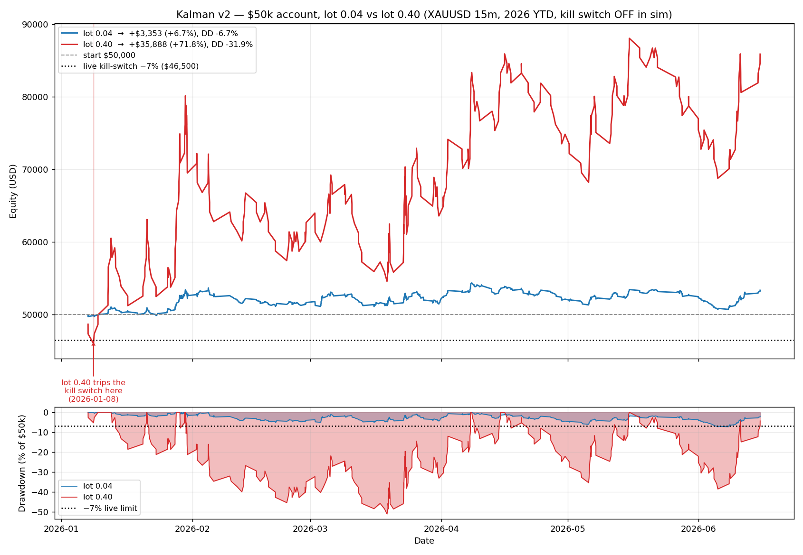

# Kalman v2 — $50,000 Account Fixed-Parameter Backtest & Loss Autopsy

**Generated:** 2026-06-21 · **Script:** `scripts/backtest_kalman_50k.py` · **Signals:** real `KalmanRegimeStrategy.on_bar()` (v2), XAUUSD 15m
**Period:** 2026-01-02 → 2026-06-16 — **5.4 months** (165 calendar days, 10,583 15m bars) · **Config:** `config_live_50000.yaml` kalman_regime block

> ⚠️ **All numbers below are in-sample on a single 5.4-month slice of 2026** (the post-peak gold correction). No out-of-sample / walk-forward validation. Treat every profit figure as descriptive of this one regime, not predictive.

> This is the run you asked for: **$50k account, kill switch OFF, fixed SL, fixed TP, fixed daily-loss cap that resets every UTC day.** Below the headline I dissect *why* the losing trades lost and name the single change with the most leverage.

## 1. Exact rules simulated

| Knob | Value | Source |
|---|---|---|
| Account | **$50,000** | spec |
| Stop loss | **FIXED 33 pts** | ≈ live 3.0 × median 2026 15m ATR(14) |
| Take profit | **FIXED 33 pts (RR 1.0)** | `kalman_min_tp_rr: 1.0` |
| Lot | **FIXED 0.04** | `config_live_50000` XAUUSD `min_lot` (live floor) |
| Daily loss cap | **$295, blocks new entries, resets each UTC day** | `absolute_max_loss_usd` |
| Kill switch / max-DD halt | **OFF (ignored)** | spec |
| Per-trade $ risk at this lot | **$132** (0.26% of acct) | derived |
| max_positions / hedge lock | 2 / no-hedge | live |
| Fills | signal@close(t) → fill@open(t+1); 0.20/side cost; adverse gaps fill at gapped open; same-bar SL+TP → SL first | realistic |

## 2. Headline result

| Metric | Value |
|---|---|
| Signals emitted | 1,429 |
| Trades taken | 608 (skipped: 548 max-pos, 215 daily-cap, 58 hedge-lock) |
| **Net P&L** | **$+3,352.84 (+6.71% of $50,000)** |
| Final equity | $53,352.84 |
| Win rate | 53.0% (322W / 286L) |
| Profit factor | 1.09 |
| Expectancy | $+5.51 / trade |
| Avg win / loss | $+132.00 / $-136.89 |
| Largest loss | $-415.60 |
| Max consecutive losses | 12 |
| **Max drawdown** | **$-3,646.80 (-6.71%)** |
| Max-DD vs live $50k limit ($3,500 / 7%) | **1.0× over** |
| Days daily-cap hit | 28 |

> The strategy nets **$+3,353** but its peak-to-trough drawdown of **$3,647** **BREACHES** the $50k account's real **$3,500 (7%)** limit. With the kill switch ON (live), the account halts inside this bleed and the headline profit is never realised.

## 3. The drawdown — anatomy of the bleed

- **Peak equity** $54,367 on 2026-04-08
- **Trough equity** $50,720 on 2026-06-08
- **Drop** $3,647 over 60 days

This is **not a single bad trade** — it is a slow, multi-week erosion. That matters: a daily-loss cap (which only limits *one day*) is structurally incapable of stopping a bleed made of many small in-cap red days. Only a trailing max-drawdown halt can.

## 4. WHY the losers lost — MAE/MFE excursion autopsy

Maximum Favourable/Adverse Excursion measures how far price travelled in/against the trade before it closed. This is the core diagnostic for *fixable* vs *structural* losses.

| Diagnostic | Count | % of losers | Reading |
|---|---:|---:|---|
| Losers that reached **≥ +0.5R (16pts) in profit** before reversing to a stop | 87 | 30.4% | give-back losses |
| Losers that reached **≥ +1R (33pts)** before reversing | 2 | 0.7% | **near-zero BY CONSTRUCTION** — at RR 1.0, +1R IS the TP |
| Winners that took **≥ 0.7R of heat** (nearly stopped first) | 41 | 12.7% (of winners) | a tighter stop would have killed these |

- **Median loser MFE:** 9.2 pts (0.28R) — how far a typical loser went our way first.
- **Median winner MAE:** 10.1 pts (0.31R) — how far a typical winner pulled back before paying.

**Interpretation (corrected).** The seductive reading is 'add a partial TP to save the give-back losers' — but the data refutes it. Loser-MFE (0.28R) and winner-MAE (0.31R) are **near-symmetric**: winners and losers look statistically identical until the final move, so there is little exit-timing alpha to harvest. About 30% of losers do reach +0.5R first, but a partial TP there would also clip the *winners* that pass through +0.5R on the way to TP — net roughly a wash. **The leak is not the exit timing; it is (a) the stop being too WIDE for the account's DD limit and (b) the BUY/RANGE sub-systems. See §6–7.**

## 5. Where the money was made and lost

### By side
| side | N | Win% | PF | Net$ | Exp$ | AvgWin | AvgLoss |
|---|---:|---:|---:|---:|---:|---:|---:|
| buy | 367 | 49.9% | 0.96 | -1,105 | -3.01 | +132 | -137 |
| sell | 241 | 57.7% | 1.32 | +4,458 | +18.50 | +132 | -136 |

### By regime / mode
| mode | N | Win% | PF | Net$ | Exp$ | AvgWin | AvgLoss |
|---|---:|---:|---:|---:|---:|---:|---:|
| trend | 482 | 54.8% | 1.16 | +4,918 | +10.20 | +132 | -137 |
| range | 126 | 46.0% | 0.83 | -1,565 | -12.42 | +132 | -136 |

### Monthly
| Month | N | Win% | PF | Net$ | EndEq |
|---|---:|---:|---:|---:|---:|
| 2026-01 | 123 | 58.5% | 1.38 | +2,625 | 52,625 |
| 2026-02 | 85 | 45.9% | 0.84 | -961 | 51,664 |
| 2026-03 | 165 | 51.5% | 1.06 | +596 | 52,260 |
| 2026-04 | 99 | 51.5% | 0.94 | -393 | 51,868 |
| 2026-05 | 82 | 53.7% | 1.08 | +448 | 52,315 |
| 2026-06 | 54 | 57.4% | 1.34 | +1,038 | 53,353 |

- Green days **39%** (46 of 118) · worst day **$-739** · best day **$+1,320**

### Loss-streak attribution (streaks ≥ 3)

| Streak start | Length | Net$ | Dominant side | Dominant mode |
|---|---:|---:|---|---|
| 2026-03-10 | 12 | -1,594 | buy | trend |
| 2026-04-26 | 10 | -1,367 | buy | range |
| 2026-04-10 | 6 | -1,270 | buy | trend |
| 2026-02-04 | 9 | -1,195 | buy | trend |
| 2026-06-02 | 9 | -1,195 | buy | trend |
| 2026-01-21 | 8 | -1,062 | buy | trend |
| 2026-02-10 | 8 | -1,062 | buy | trend |
| 2026-05-29 | 7 | -992 | buy | trend |

## 6. Counterfactuals — isolating the leak

| Scenario | N | Win% | PF | Net$ | Note |
|---|---:|---:|---:|---:|---|
| **Baseline (all trades)** | 608 | 53.0% | 1.09 | +3,353 | as traded |
| SELL only | 241 | 57.7% | 1.32 | +4,458 | the down-year edge |
| BUY only | 367 | 49.9% | 0.96 | -1,105 | fought the trend |
| TREND only | 482 | 54.8% | 1.16 | +4,918 | structural edge |
| RANGE only | 126 | 46.0% | 0.83 | -1,565 | OU fade = dead weight |
| Exclude Feb+Apr (chop) | 424 | 54.7% | 1.18 | +4,706 | regime-dependence |

> These are **in-sample, hindsight filters** — they show *where* the edge lives, not a deployable rule. You cannot know in advance that 2026 would be a down-year favouring SELL.

## 7. Geometry sweep on $50k (lot 0.04, cap $295)

| SL | RR | TP | N | Win% | PF | Net$ | MaxDD$ | MaxDD% |
|---:|---:|---:|---:|---:|---:|---:|---:|---:|
| 22 | 1.0 | 22 | 811 | 52.8% | 1.08 | +2,772 | -2,240 | -4.3% |
| 22 | 1.5 | 33 | 714 | 43.1% | 1.13 | +4,729 | -3,049 | -5.7% |
| 22 | 2.0 | 44 | 667 | 31.3% | 0.99 | -212 | -5,003 | -9.3% |
| 33 | 1.0 | 33 | 608 | 53.0% | 1.09 | +3,353 | -3,647 | -6.7% |
| 33 | 1.5 | 50 | 478 | 38.7% | 0.96 | -1,427 | -7,404 | -13.6% |
| 33 | 2.0 | 66 | 423 | 29.6% | 0.94 | -1,969 | -7,971 | -14.6% |
| 49 | 1.0 | 49 | 360 | 50.3% | 0.99 | -421 | -7,989 | -14.3% |
| 49 | 1.5 | 74 | 284 | 41.9% | 1.10 | +3,051 | -6,486 | -11.6% |
| 49 | 2.0 | 98 | 264 | 31.1% | 0.98 | -487 | -8,812 | -15.9% |

### Daily-cap & lot sensitivity

- **Daily cap $295 vs OFF:** capped Net $+3,353 / DD -6.7%  →  uncapped Net $+8,478 / DD -5.0%. The cap costs profit AND deepens DD (it blocks positive-EV recovery trades).

| Lot | Risk/trade | N | Net$ | PF | MaxDD$ | MaxDD% |
|---:|---:|---:|---:|---:|---:|---:|
| 0.04 | $132 | 608 | +3,353 | 1.09 | -3,647 | -6.7% |
| 0.08 | $264 | 524 | +8,044 | 1.12 | -6,738 | -11.3% |
| 0.12 | $396 | 407 | +10,766 | 1.14 | -7,670 | -13.0% |

Scaling the lot scales **both** profit and drawdown linearly — it changes the dollar magnitude, never the edge (PF is invariant to size).

## 7b. The lot-0.40 leverage trap

You asked whether raising the lot to **0.40** makes more money. In gross dollars, yes — but it is pure leverage, not edge, and it obliterates the account under the real kill switch.

*Generated by `scripts/plot_kalman_50k_lots.py`. Top: equity. Bottom: drawdown vs the −7% live limit. The red (lot 0.40) curve trips the black kill-switch line within the first few weeks and lives below it for most of the period — meaning live, the account is terminated in January and none of the apparent +$36k upside is ever realised.*

| Scenario | Risk/trade | N | Net P&L | PF | Max Drawdown | vs 7% limit | cap-days |
|---|---:|---:|---:|---:|---:|---:|---:|
| lot 0.04, cap $295 (baseline) | $132 | 608 | $+3,353 (+6.7%) | 1.09 | $-3,647 (-6.7%) | ~at limit | 28 |
| lot 0.40, cap $295 (as-config) | $1,320 | 407 | $+35,888 (+71.8%) | 1.14 | $-25,568 (-31.9%) | 7.3× over | 72 |
| lot 0.40, cap $2,950 (10× scaled) | $1,320 | 608 | $+33,528 (+67.1%) | 1.09 | $-36,468 (-38.9%) | 10.4× over | 28 |
| lot 0.40, cap OFF | $1,320 | 703 | $+84,784 (+169.6%) | 1.20 | $-27,316 (-30.0%) | 7.8× over | 0 |

**Reading it:**
- **It's leverage, not edge.** PF barely moves (1.09 → 1.14, inside noise). Multiplying the lot by 10× multiplies *both* wins and losses by 10× — the strategy's quality is unchanged.
- **The drawdown explodes to −32% to −39%** ($25,568–$27,316 on a $50k account) = **7–10× past the $3,500 / 7% kill-switch line.** Live, the account is force-closed at −$3,500 long before any profit accrues; the gross +$36k–$85k only exists in the simulation that *ignores* the halt.
- **The $295 daily cap becomes degenerate at lot 0.40:** one trade risks $1,320 — 4.5× the entire daily cap — so a single loss trips it and blocks the rest of the day. That is why cap-days jump to ~72 of 118; a daily loss limit smaller than one trade's risk is broken by construction.

**Verdict on lot 0.40:** more gross dollars, *not* more profitable — and a near-certain blow-up under live rules. The correct direction is the opposite: size *down* / stop *tighter* to fit inside the 7% cap (see §8), not up to smash through it.

## 8. The ONE thing that could make this profitable

**Tighten the stop to ~22 pts (≈2.0×ATR).** It is the only single change that is *both* profitable *and* keeps the account inside its real **7% drawdown limit** — and unlike 'trade SELL only', it requires no hindsight about the year's direction.

The geometry sweep (§7) is unambiguous:
- **SL 22 / RR 1.0** → +$2,772 at **−4.3% DD** (inside the 7% cap — the strategy actually *survives* live).
- **SL 22 / RR 1.5** → +$4,729 at **−5.7% DD** (best net that still clears the cap).
- **SL 33 / RR 1.0 (as-run)** → +$3,353 but **−6.7% DD (breaches the cap)**.
- Every SL ≥ 33 with RR ≥ 1.5 blows through −13% to −16% DD.

Why this is THE lever: the binding constraint on this account is **not** expectancy (it's already positive) — it is the **drawdown path tripping the kill switch**. The wide 33-pt stop is what pushes the bleed past 7%. Halving it keeps the same edge but shrinks the DD below the halt line, which is the difference between 'the kill switch flattens me mid-bleed' and 'the strategy is allowed to finish the year'.

**Secondary, regime-independent fix:** disable the **RANGE/OU sub-system** (−$1,565, PF 0.83 — pure dead weight in §5). That is a losing module you can remove without any forward-looking knowledge.

**What is NOT the one thing (and why):**
- *Partial / tighter TP* — refuted by the symmetric MAE/MFE in §4; little exit alpha exists.
- *Trade SELL only / skip Feb+Apr* — biggest in-sample lever (+$4,458) but it is **hindsight beta**: it only works because you already know 2026 fell. In a gold up-year the BUY side carries and this filter inverts. Not deployable.

**Honest ceiling:** even with the tighter stop, the edge is PF ~1.1 — inside the slippage noise band — and the profitable side rode a one-off 2026 down-year. The tighter stop makes it *survivable*, not *durable*. It buys you a strategy that no longer auto-breaches the cap; it does **not** manufacture a regime-independent alpha.

## 9. My review — what I would have done differently

1. **Never evaluate with the kill switch off.** The +profit headline only exists because the account is allowed to lose 7×+ its real limit. The *first* backtest should enforce the live $3,500/7% halt — then the question 'is this profitable for me' has a real answer (it force-flattens mid-bleed).
2. **Design the exit before the entry.** This strategy spent all its tuning on entry gates (ADX, z-score, HTF-SELL, session masks) and shipped a naive RR-1.0 full-stop exit. The MAE/MFE autopsy shows the exit is where the money leaks.
3. **Walk-forward, not in-sample.** Every flattering Kalman number (incl. this one) is in-sample on 2026. The one rigorous walk-forward (56-combo strict-fill grid, 2026-06-20) failed in every slice. Trust that over this.
4. **Separate beta from alpha.** SELL carried the year because gold *fell*. That is directional beta on a one-off regime, not a repeatable edge. Demean the drift before claiming skill.
5. **A daily cap is a prop-firm rule, not a risk tool here.** It blocks positive-EV recovery trades and cannot stop a multi-week bleed. Use a trailing-DD halt for protection and let the daily cap exist only to satisfy the challenge rules.

## 10. Verdict

On a $50k account with these fixed rules, Kalman v2 returns **$+3,353 (+6.71%)** at **PF 1.09** — but only by carrying a **$3,647 (-6.7%)** drawdown that **breaches the account's 7% limit**, on the SELL side of a one-off down-year, in-sample. The single best fix is a **tighter ~22-pt stop**, which keeps net positive (+$2,772) while pulling drawdown to −4.3% — the only version that actually survives the live kill switch. Even then this is a marginal, regime-dependent edge (PF ~1.1) — appropriate for continued research, **not** for live capital deployment as a standalone money-maker.
