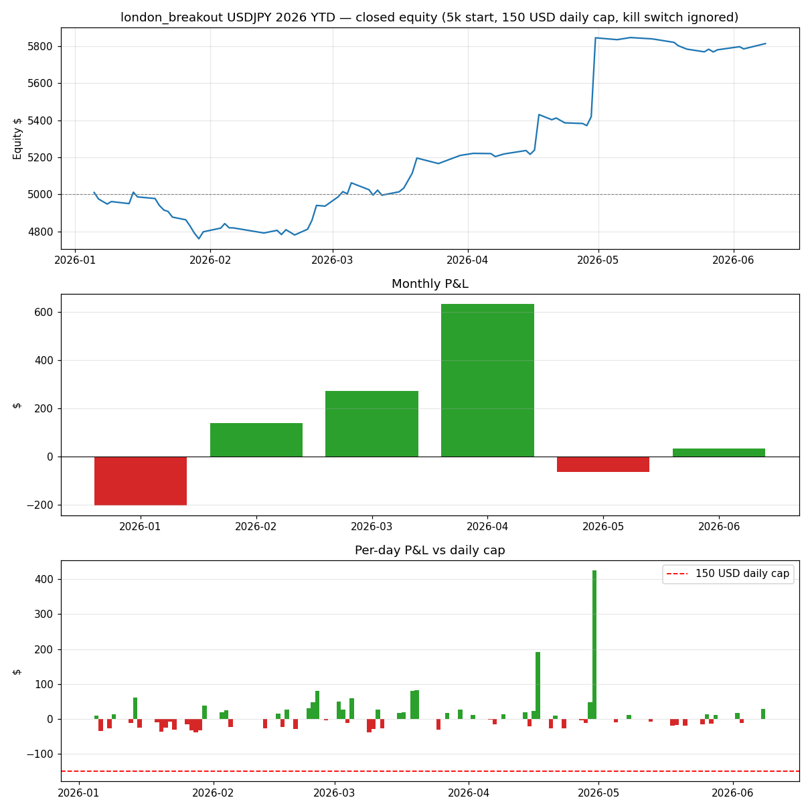

# london_breakout — 2026 YTD Backtest (Jan 1 → Jun 10, 2026) · USDJPY

**Run date:** 2026-06-12
**Setup:** `config_live_5000.yaml` clone · **$150 daily loss cap enforced** (`--enforce-risk`, resets to 0 each new trading day — run never halts) · **kill switch ignored** (trailing-DD limits → ∞, circuit breaker off) · realistic fills · 5m bars (Dukascopy) · $50 risk/trade · $5,000 initial capital. Fed from 2025-12-22 for warm-up; analysis covers 2026 trades only.

## Headline

| | Trades | Win rate | P&L | PF | Avg R | Max DD (closed equity) | Exits |
|---|---|---|---|---|---|---|---|
| **USDJPY** | 73 | 46.6% | **+$812.99 (+16.3%)** | 2.04 | +0.37R | **−$251.24** | 48× time_stop, 25× stop_loss |

The **$150 daily cap never bound and structurally cannot**: london_breakout fires at most once per day, risking ~$50, so the worst possible day is a single stop-out (worst actual: −$37.72 on Jan 28). The cap and its daily reset were inert for this strategy in isolation.

**The kill switch is the setting that mattered.** Max closed-equity drawdown was −$251.24, trough on **Jan 29** — $1.24 past the live $250 trailing-DD limit. A live account running this strategy alone from Jan 1 would have been killed at the end of January, missing the entire +$1,015 Feb–Apr recovery.

## Month-to-month

| Month | Trades | W/L | Win rate | P&L | PF | Avg R | Worst day | Story |
|---|---|---|---|---|---|---|---|---|
| Jan | 17 | 4/13 | 23.5% | **−$201.78** | 0.38 | −0.32R | −$37.72 | Brutal start: a 10-trade losing streak (Jan 14→29) drove the −$251 max DD. 8 of the year's 25 stop-outs landed here. |
| Feb | 13 | 7/6 | 53.8% | **+$138.37** | 2.31 | +0.29R | −$28.41 | Recovery begins; only 2 stop-outs, 11 time-stop exits. |
| Mar | 15 | 10/5 | 66.7% | **+$273.35** | 3.02 | +0.63R | −$37.38 | Best win rate of the year; steady grind, best trades +$82/+$80. |
| Apr | 15 | 8/7 | 53.3% | **+$634.25** | 6.98 | +1.34R | −$27.41 | The month that made the year — two SELL runners: Apr 30 **+$425.58 (+8.5R)** and Apr 17 +$191.45. |
| May | 10 | 3/7 | 30.0% | **−$64.75** | 0.36 | −0.41R | −$18.89 | Chop; best trade only +$13.84. Edge went quiet. |
| Jun (→10th) | 3 | 2/1 | 66.7% | **+$33.55** | 3.80 | +1.12R | −$11.97 | Small sample, mildly positive. |

Cumulative closed P&L by month-end: −$202 → −$63 → +$210 → +$844 → +$779 → +$813.

## Deep read

1. **This is a fat-tail strategy, and the numbers prove it.** Median trade is **−0.12R** (a typical day loses a little); the year is carried by 15 trades > +1R and especially 4 trades > +3R. The **top 3 trades = $699 = 86% of YTD P&L**. Remove just the Apr 30 runner and YTD drops to +$387, PF 1.49.
2. **No-TP + 360-min time stop is doing its job.** 48 of 73 exits were the time stop; the two Apr runners (+8.5R, +3.8R) only exist because nothing capped them. This matches why BE/lock is disabled for this strategy.
3. **PF 2.04 YTD beats the research expectation** (1.23 IS / 1.44 OOS, 1.39 realistic-fill) — but that's the April tail talking, not a better edge. Ex-best-trade PF 1.49 is right on the OOS number.
4. **Monthly P&L is streaky: 0.38 → 2.31 → 3.02 → 6.98 → 0.36 → 3.80.** Jan and May were both sub-0.4 PF months. Anyone judging this strategy on a 1-month window would have killed it twice this year.
5. **Live-limits implication:** in isolation the strategy cannot threaten the $150 daily cap, but its 10-loss streak (~$250 over 2 weeks) is exactly the size of the trailing-DD kill switch. Live, it shares that $250 budget with kalman and monday_drift — a Jan-style streak plus any other strategy's losses trips the kill switch well before trade 10.

## Artifacts

- `reports/london_breakout_2026_backtest.png` — equity curve, monthly P&L, per-day P&L vs cap
- `reports/london_breakout_2026_usdjpy_trades.csv` — full 2026 trade list
- Reproduce: `python scripts/run_backtest.py --strategy london_breakout --symbol USDJPY --timeframe 5m --start 2025-12-22 --end 2026-06-10 --slippage realistic --enforce-risk` with the config tweaks above (max_drawdown → ∞, circuit_breaker off, daily cap $150 kept)
