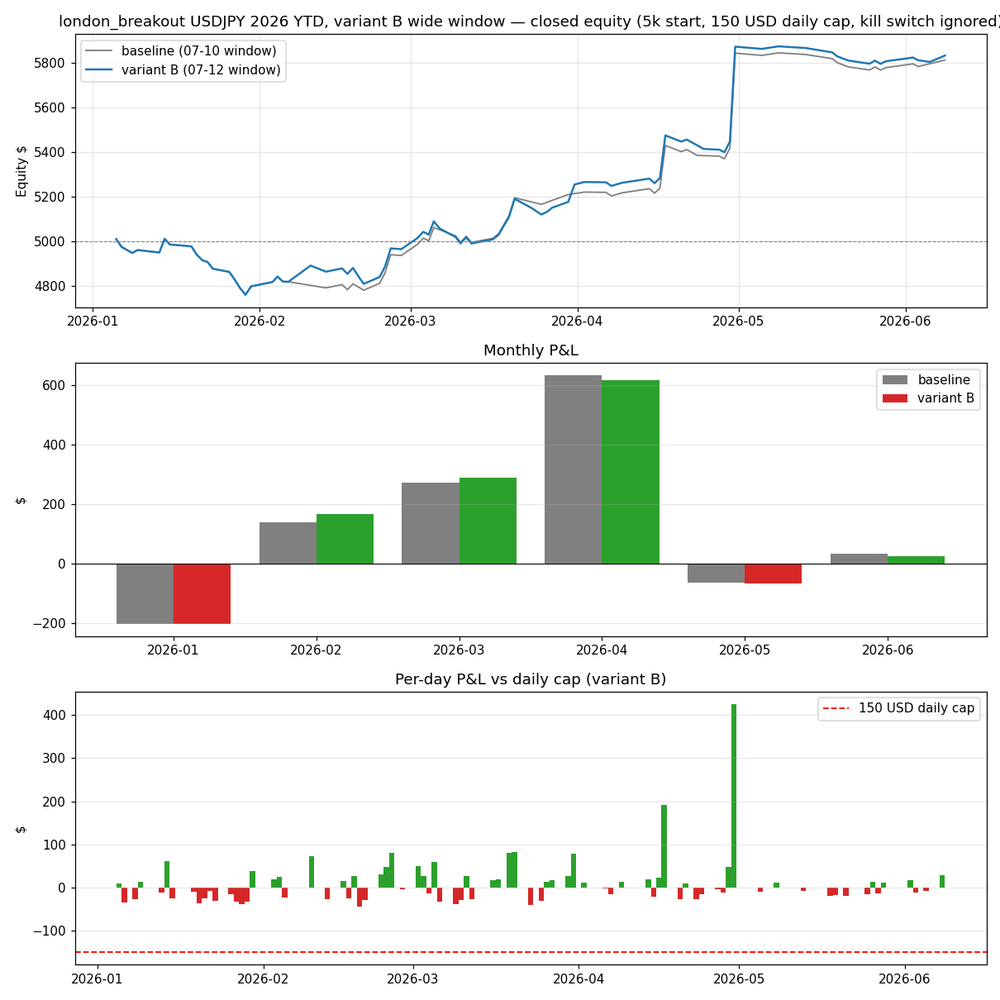

# london_breakout variant B (wide window) — 2026 YTD Backtest (Jan 1 → Jun 10, 2026) · USDJPY

**Run date:** 2026-06-12
**Change vs shipped:** entry window widened 07:00–09:59 → **07:00–11:59 UTC** (`entry_end_hour: 10 → 12`). Adopted by **user decision 2026-06-12** knowing it is mildly dilutive per trade (frequency research: OOS PF 1.44 → 1.38; marginal trades alone PF ~1.17). One-trade-per-day latch unchanged.
**Setup:** identical to `reports/london_breakout_2026_backtest.md` — `config_live_5000.yaml` clone · $150 daily loss cap enforced (resets daily, run never halts) · kill switch ignored · realistic fills · 5m bars · $50 risk/trade · $5,000 start.

## Headline — variant B vs baseline

| | Trades | Win rate | P&L | PF | Avg R | Max DD | Worst day | Days ≤ −$150 |
|---|---|---|---|---|---|---|---|---|
| Baseline (07–10) | 73 | 46.6% | +$812.99 | 2.04 | +0.37R | −$251.24 | −$37.72 | 0 |
| **Variant B (07–12)** | **81** | 45.7% | **+$833.47 (+16.7%)** | 1.90 | +0.33R | −$251.24 | −$43.06 | 0 |

The 8 marginal trades (all entered 10:00–11:59 on days the range didn't break before 10:00) netted **+$23.32 at PF 1.17, 37.5% WR** — in line with the research expectation that the late window adds roughly break-even trades. Max drawdown is identical (the Jan losing streak happens in the early window either way), and the $150 daily cap remains structurally unreachable (still one trade/day, ~$50 risk).

## Month-to-month (variant B)

| Month | Trades | W/L | WR | P&L | PF | vs baseline | Story |
|---|---|---|---|---|---|---|---|
| Jan | 17 | 4/13 | 23.5% | **−$201.78** | 0.38 | ±0 | Unchanged — the 10-loss streak (Jan 14–29, −$251 DD) all fired pre-10:00. |
| Feb | 15 | 8/7 | 53.3% | **+$166.71** | 2.11 | **+$28.34** | 2 late-window trades, both contributions positive. Best marginal month. |
| Mar | 19 | 12/7 | 63.2% | **+$290.15** | 2.39 | **+$16.80** | 4 late trades, net positive. |
| Apr | 16 | 8/8 | 50.0% | **+$618.24** | 6.06 | −$16.01 | One late loser; the +$425 (8.5R) Apr 30 runner unchanged. |
| May | 10 | 3/7 | 30.0% | **−$65.65** | 0.36 | −$0.90 | Chop either way. |
| Jun →10 | 4 | 2/2 | 50.0% | **+$25.80** | 2.31 | −$7.75 | One late loser. |

Cumulative by month-end: −$202 → −$35 → +$255 → +$873 → +$808 → +$833.
Exits: 51× time_stop, 30× stop_loss.

## Read

1. **YTD the trade-off behaved exactly as the research predicted:** +8 trades (+11%), +$20 net, PF 2.04 → 1.90. The late window is roughly break-even ballast — it adds activity, not edge.
2. **Risk profile unchanged:** same −$251.24 max DD (Jan 29 trough; would still clip the live $250 kill switch by $1.24 if the strategy ran alone uncapped), same zero proximity to the daily cap.
3. **What to watch live:** if the marginal 10:00–11:59 entries trend negative over a meaningful sample (research says PF ~1.0–1.17 at flat costs, and strict fills eat thin edges), reverting is the one-line change `entry_end_hour: 12 → 10`.

## Artifacts

- `reports/london_breakout_2026_varB_backtest.png` — equity (vs baseline), monthly P&L (vs baseline), per-day P&L vs cap
- `reports/london_breakout_2026_varB_usdjpy_trades.csv` — full 2026 trade list
- Baseline report: `reports/london_breakout_2026_backtest.md` · Frequency research: `scripts/research_lbo_frequency.py`
- Shipped: `entry_end_hour: 12` in all `config_live_*.yaml` + `config_backtest_usdjpy_lbo.yaml` (2026-06-12)
