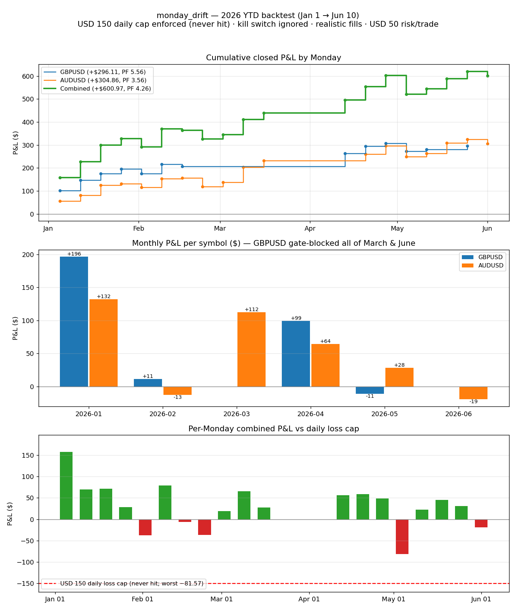

# monday_drift — 2026 YTD Backtest (Jan 1 → Jun 10, 2026)

**Run date:** 2026-06-12
**Setup:** `config_live_5000.yaml` clone · **$150 daily loss cap enforced** (`--enforce-risk`) · **kill switch ignored** (trailing-DD limits → ∞, circuit breaker off) · realistic fills · 15m bars (resampled from Dukascopy 5m) · $50 risk/trade · $5,000 initial capital. Data fed from 2025-10-01 so the SMA(50) regime gate was fully warmed before January; analysis covers 2026 trades only.

## Headline

| | Trades | Win rate | P&L | PF | Avg R | Max DD (closed equity) | Exits |
|---|---|---|---|---|---|---|---|
| **GBPUSD** | 13 | 76.9% | **+$296.11** | 5.56 | +0.47R | −$34.93 | 13× time_stop |
| **AUDUSD** | 18 | 77.8% | **+$304.86** | 3.56 | +0.35R | −$46.64 | 17× time_stop, 1× stop_loss |
| **Combined** | 31 | 74.2% | **+$600.97 (+12.0%)** | 4.26 | — | **−$81.57** | — |

The **$150 daily cap never came close to binding** — worst Monday was −$81.57 (May 4). Ignoring the kill switch changed nothing either: max closed-equity drawdown was that same $81.57, well inside the live $250 limit. With $50/trade and one trade per pair per Monday, the structural worst case (~−$95/day) sits under the cap by design.

## Month-to-month

| Month | GBPUSD | AUDUSD | Combined P&L | Combined WR | Story |
|---|---|---|---|---|---|
| Jan | 4/4 wins, +$196.31 | 4/4 wins, +$131.88 | **+$328.19** | 100% | Anti-USD drift at full strength; best Monday Jan 5 (+$157.76). GBP caught a +2.08R runner (+$102). |
| Feb | 1W/2L, +$11.13 (PF 1.37) | 2W/2L, −$12.70 (PF 0.76) | **−$1.57** | 42.9% | Only losing month, and it lost almost nothing. 3 of the run's 5 red Mondays landed here. |
| Mar | **0 trades — gate-blocked all month** | 3/3 wins, +$112.28 | **+$112.28** | 100% | GBP below SMA(50) every March Monday; the regime kill-switch sat the pair out while AUD kept printing. |
| Apr | 3/3 wins, +$99.48 | 2/2 wins, +$64.42 | **+$163.90** | 100% | Both pairs gate-blocked the first 1–2 Mondays, then clean wins on re-entry. |
| May | 2W/1L, −$10.81 | 3W/1L, +$28.33 | **+$17.52** | 71.4% | Worst day of the run: **May 4, −$81.57** — both pairs red, incl. the run's only stop-loss exit (AUD −1.0R = −$46.64). |
| Jun (→10th) | 0 trades — gate-blocked | 1 loss, −$19.35 | **−$19.35** | 0% | Both pairs blocked Jun 8; GBP also Jun 1. The gate is closing. |

Cumulative combined equity by month-end: $328 → $327 → $439 → $603 → $620 → $601.

## Deep read

1. **The two pairs are one bet.** Same-Monday P&L correlation **0.85** across 12 shared Mondays. They diversify entry opportunities (the gate blocks them at different times), not risk.
2. **The SMA(50) gate earns its keep.** GBPUSD blocked 10 of 23 Mondays (all of March, early April, late May–June); AUDUSD 5 of 23. March is the proof case: GBP below trend → zero GBP trades → AUD alone still made +$112.
3. **The drift is visibly fading.** Jan alone is 55% of the year's P&L; May 1 → Jun 10 is net −$2, and both pairs were gate-blocked on Jun 8. Consistent with the regime-trade warning — if blocks keep stacking, that's the 2025–26 anti-USD regime ending, not a reason to loosen the gate.
4. **The risk settings tested were irrelevant to the outcome** (good news): zero days beyond −$100, max equity DD $81.57 vs the $250 kill switch. monday_drift as sized cannot structurally threaten either limit on its own; the limits only matter when it shares the day with kalman/london_breakout losses.
5. **30 of 31 exits were the 1230-min time stop** — the edge is purely the drift hold; the 1.0×ATR stop almost never gets touched.

## Artifacts

- `reports/monday_drift_2026_backtest.png` — equity curve, monthly P&L, per-Monday P&L vs cap
- `reports/monday_drift_2026_gbpusd_trades.csv`, `reports/monday_drift_2026_audusd_trades.csv` — full trade lists (incl. Dec 2025 warm-up trades)
- Reproduce: `python scripts/run_backtest.py --strategy monday_drift --symbol {GBPUSD,AUDUSD} --timeframe 15m --start 2025-10-01 --end 2026-06-10 --enforce-risk` with the config tweaks above
